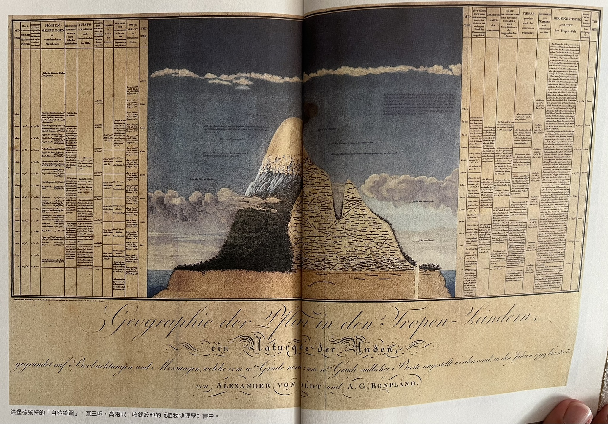
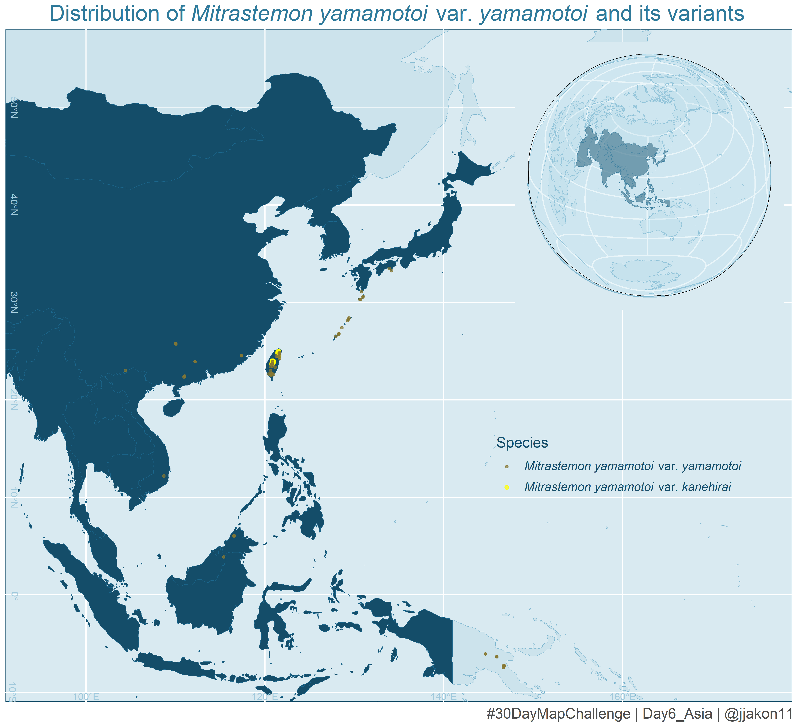
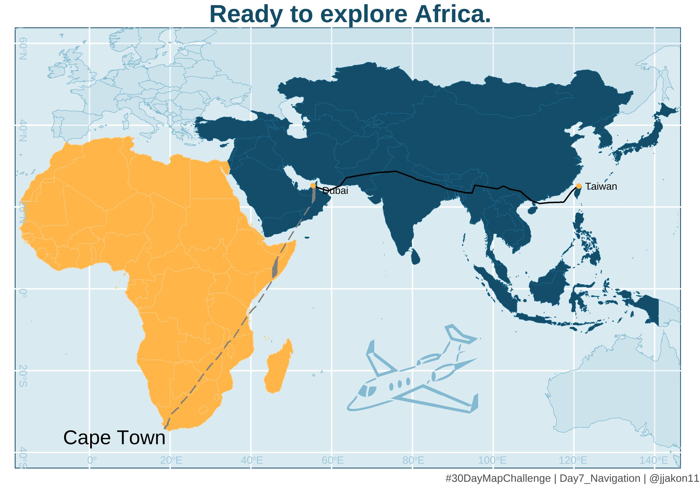
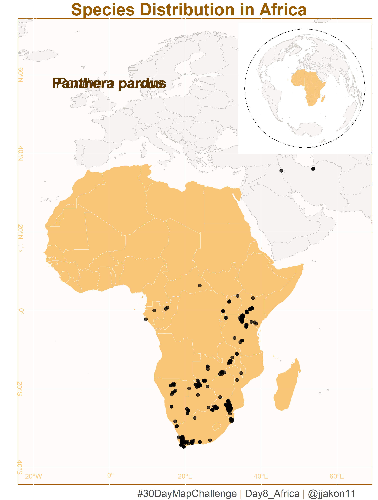
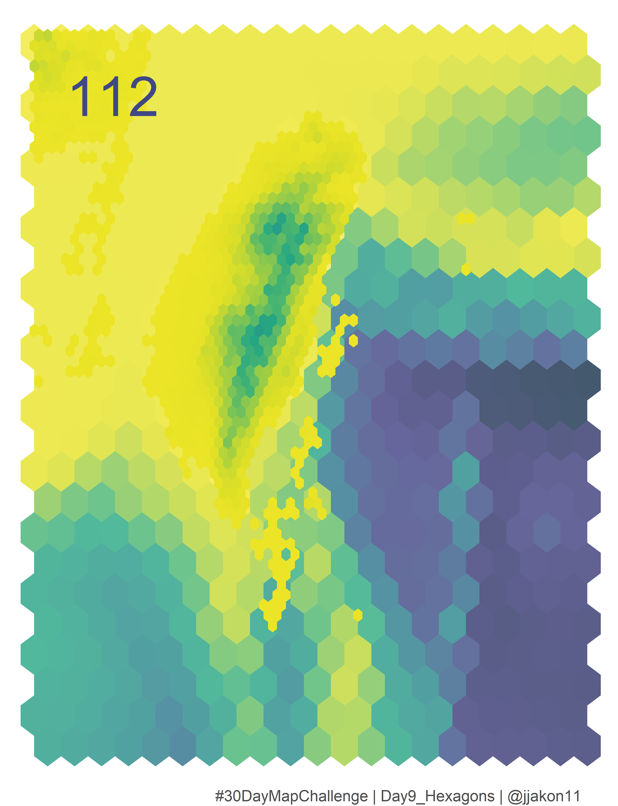
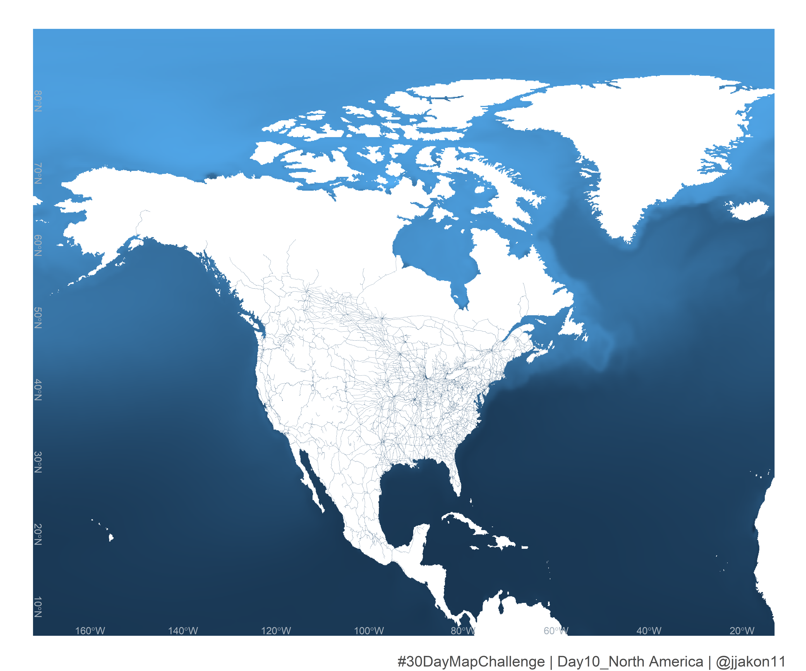

# 30 Day Map Challenge
## 2023 Challenge
The details of the challenge can be found: https://30daymapchallenge.com/. It was raised by Topi Tjukanov.

This is my first year to attend the 30 day map challenge on social media, which post the map that produce everyday in every November.

Daily topic for 2023 Noveber:

***

### Day1: Points
**Map point of Taiwan climate station**
I attend a great challenge in this November. No idea when I will give up this hard core challenge. My goal is to out put all of the map by R program around 1 hours (hopefully...). 

### Day2: Lines
**River Map in Taiwan**

Second day challenge of plotting map with R program: Lines. I utilized Taiwan's main river and tributary shapefiles to represent the contours of our island.  An Ocean Digital Elevation Model (DEM) is also included as the base map to highlight the island's remarkable features.

- Data resource: 
  
  - River and Tributary: https://gic.wra.gov.tw/Gis/Gic/API/Google/Index.aspx
  
  - Ocean DEM: https://www.gebco.net/

  
### Day3: Polygons
**Village Map of Taiwan**

My third-day challenge: mapping a graph with the R program using Polygons. This is a basic graph for those starting to learn how to plot with GIS. The graph shows the number of people living in different villages in Taiwan in 2022. Each polygon in this graph represents a village. In this graph, I aim to depict the level of luxury in each big city and the tranquility in each small downtown. And where are you now?
(I think the most challenging step is not coding but choosing great colors. Last night, I spent 2 hours to output this graph...for color selection)

- Data source: 
  - Taiwan Village shape file: < https://data.gov.tw/dataset/17219 >
  - Population data: < https://data.gov.tw/dataset/117988 >
  - Ocean DEM: < https://www.gebco.net/ >

### Day4: A Bad Map
**Islands**

A Bad Map day, with no clear indication of its location or the information it conveys. In this map, I used the county shapefile to represent the outlying islands of Taiwan. Try to figure out where are those island distributed in the Earth. I won't be providing an explanation today, as it's a BAD map

- Data source:

 - Taiwan county shape file: < https://data.gov.tw/dataset/7442 >
 - Taiwan Village shape file: < https://data.gov.tw/dataset/17219 >

### Day5: Anolog Map
**Humboldt's Naturgemälde**

Day 5 of my 30-day map challenge, I aim to present the species distribution along the varying elevation gradients of volcanoes Chimborazo and Cotopaxi in Ecuador . This distribution map was originally produced by Alexander von Humboldt and is referred to as 'Naturgemälde,' published in his book 'The Geography of Plants' in 1807.

- More information: https://en.wikipedia.org/wiki/Alexander_von_Humboldt

### Day6: Asia
**Distribution of 𝘔𝘪𝘵𝘳𝘢𝘴𝘵𝘦𝘮𝘰𝘯 𝘺𝘢𝘮𝘢𝘮𝘰𝘵𝘰𝘪 var. 𝘺𝘢𝘮𝘢𝘮𝘰𝘵𝘰𝘪  and its variants**

Day 6 of my 30 day map challenge is to present the distribution of 𝘔𝘪𝘵𝘳𝘢𝘴𝘵𝘦𝘮𝘰𝘯 𝘺𝘢𝘮𝘢𝘮𝘰𝘵𝘰𝘪 var. 𝘺𝘢𝘮𝘢𝘮𝘰𝘵𝘰𝘪 and 𝘔𝘪𝘵𝘳𝘢𝘴𝘵𝘦𝘮𝘰𝘯 𝘺𝘢𝘮𝘢𝘮𝘰𝘵𝘰𝘪 var. 𝘬𝘢𝘯𝘦𝘩𝘪𝘳𝘢𝘪 in Asia. 

- Data source: 
  - Species data: < https://www.gbif.org/occurrence/search >

### Day7: Navigation
**Ready to explore Africa**

---Flight Information---
Flight EK367: 23:40---9 hr 55m---05:35
Flight EK770: 03:50---9 hr 50m---11:40
--------------------------

On Day 7 of my 30-day map challenge, I present the route from Taoyuan to Cape Town International Airport for Emirates airline flights EK367 and EK770.

- Data source: 
  - Flight data: < https://zh-tw.flightaware.com/live/airport/OMDB >

### Day8: Africa
**Leopard in Africa**

On Day 8 of my 30-day map challenge, I present Leopard distribution in Africa from the GBIF database. It's been a busy week, making it a bit of a challenge to frame out the idea and also collect the data from the open database.

- Data source: 
  - Leopard data: < https://doi.org/10.15468/dl.7tbasq >

### Day9: Hexagons
**TaiStamp**

Day 9 of my 30-day map challenge, presenting a fake stamp of Taiwan's topographic figure with hexagons. I used the DEM of the island and the ocean to illustrate the density of the elevation around Taiwan.

- Data source:
  - TaiwanDEM: < https://data.gov.tw/dataset/35430 >
  - Ocean: < https://www.gebco.net/ >

### Day10: NorthAmerica
**Railway in North America**

Day 10 of my 30-day map challenge, presenting the railway of North America.

- Data sources:
  - Ocean O2 distribution: < https://www.nodc.noaa.gov/OC5/WOA05/pr_woa05.html >
  - Railway : < https://hub.arcgis.com/....../fedmaps::north....../about >

### Day13: Choropleth
**Records of Specimens in the Wild**

On the 13th day of my 30-day map challenge, I plot the distribution of plant specimens recorded in the wild. I utilized the herbarium collection data from GBIF in Taiwan.  I use the point transparency to present the varying levels of collecting frequency during different periods.

- Data source:
  - Ocean: < https://www.gebco.net/ >
  - Gbif data: < https://doi.org/10.15468/dl.fm2gfh >

