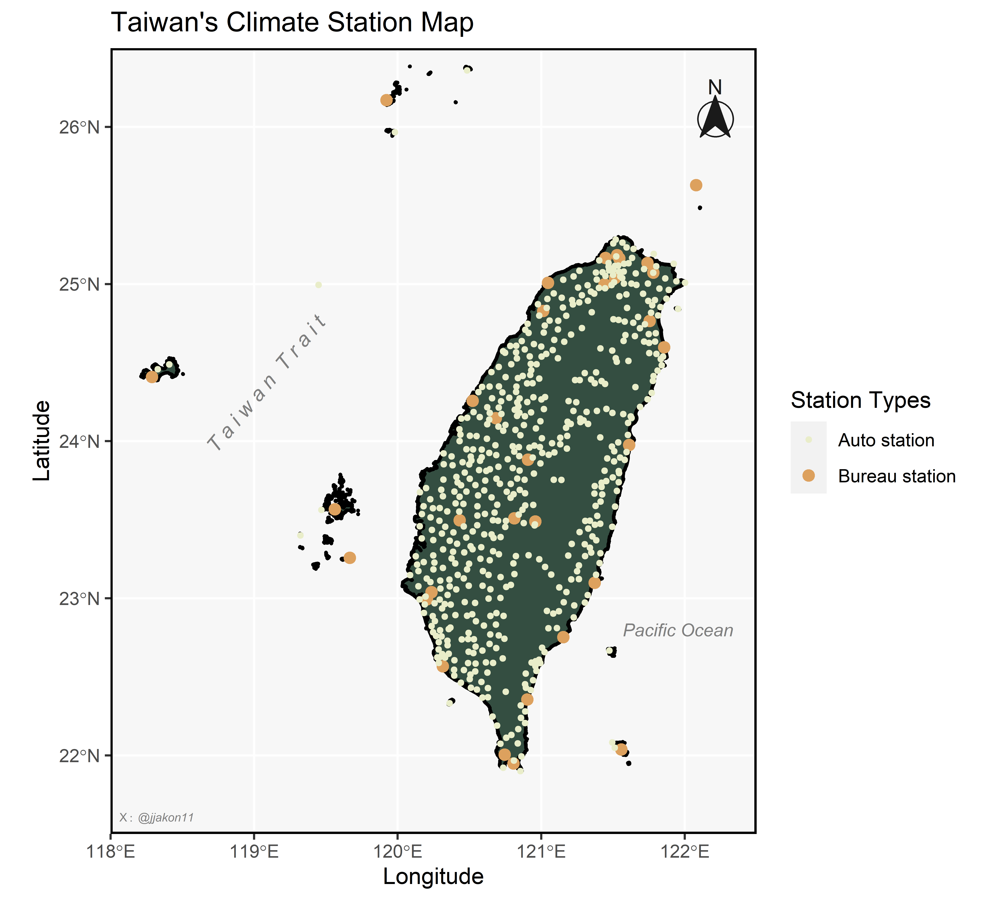
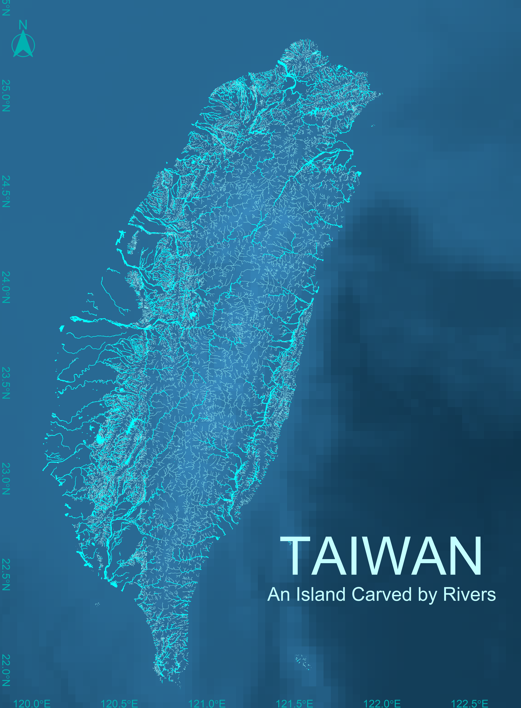
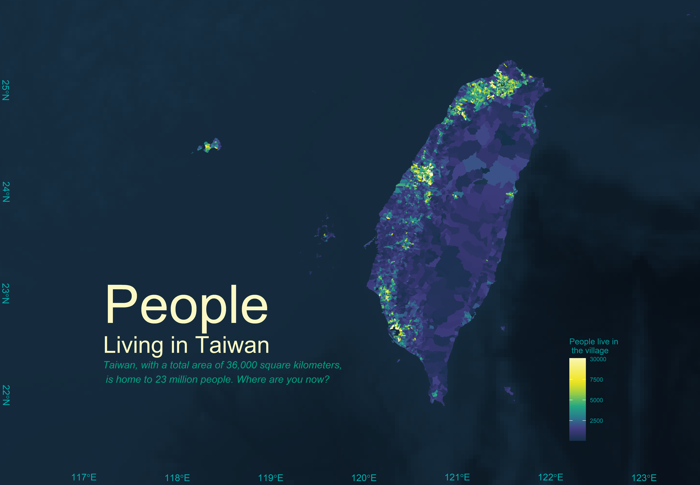
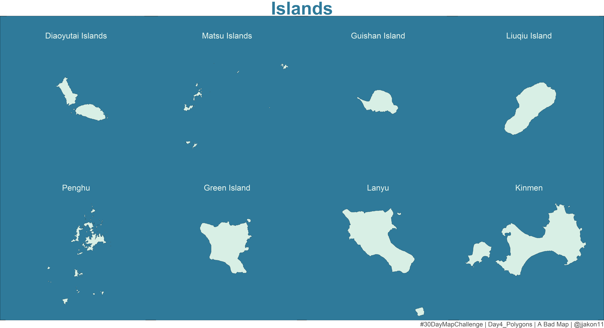

# 30 Day Map Challenge
## 2023 Challenge
The details of the challenge can be found: https://30daymapchallenge.com/. It was raised by Topi Tjukanov.

This is my first year to attend the 30 day map challenge on social media, which post the map that produce everyday in every November.

Daily topic for 2023 Noveber:

***

### Day1: Points
**Map point of Taiwan climate station**
I attend a great challenge in this November. No idea when I will give up this hard core challenge. My goal is to out put all of the map by R program around 1 hours (hopefully...). 

### Day2: Lines
**River Map in Taiwan**

Second day challenge of plotting map with R program: Lines. I utilized Taiwan's main river and tributary shapefiles to represent the contours of our island.  An Ocean Digital Elevation Model (DEM) is also included as the base map to highlight the island's remarkable features.

- Data resource: 
  
  - River and Tributary: https://gic.wra.gov.tw/Gis/Gic/API/Google/Index.aspx
  
  - Ocean DEM: https://www.gebco.net/

  
### Day3: Polygons
**Village Map of Taiwan**

My third-day challenge: mapping a graph with the R program using Polygons. This is a basic graph for those starting to learn how to plot with GIS. The graph shows the number of people living in different villages in Taiwan in 2022. Each polygon in this graph represents a village. In this graph, I aim to depict the level of luxury in each big city and the tranquility in each small downtown. And where are you now?
(I think the most challenging step is not coding but choosing great colors. Last night, I spent 2 hours to output this graph...for color selection)

- Data source: 
  - Taiwan Village shape file: < https://data.gov.tw/dataset/17219 >
  - Population data: < https://data.gov.tw/dataset/117988 >
  - Ocean DEM: < https://www.gebco.net/ >

### Day4: A Bad Map
**Islands**

A Bad Map day, with no clear indication of its location or the information it conveys. In this map, I used the county shapefile to represent the outlying islands of Taiwan. Try to figure out where are those island distributed in the Earth. I won't be providing an explanation today, as it's a BAD map

- Data source:
 - Taiwan county shape file: < https://data.gov.tw/dataset/7442 >
 - Taiwan Village shape file: < https://data.gov.tw/dataset/17219 >

