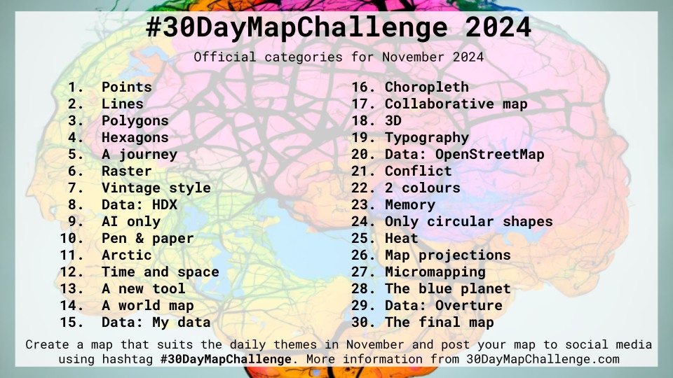
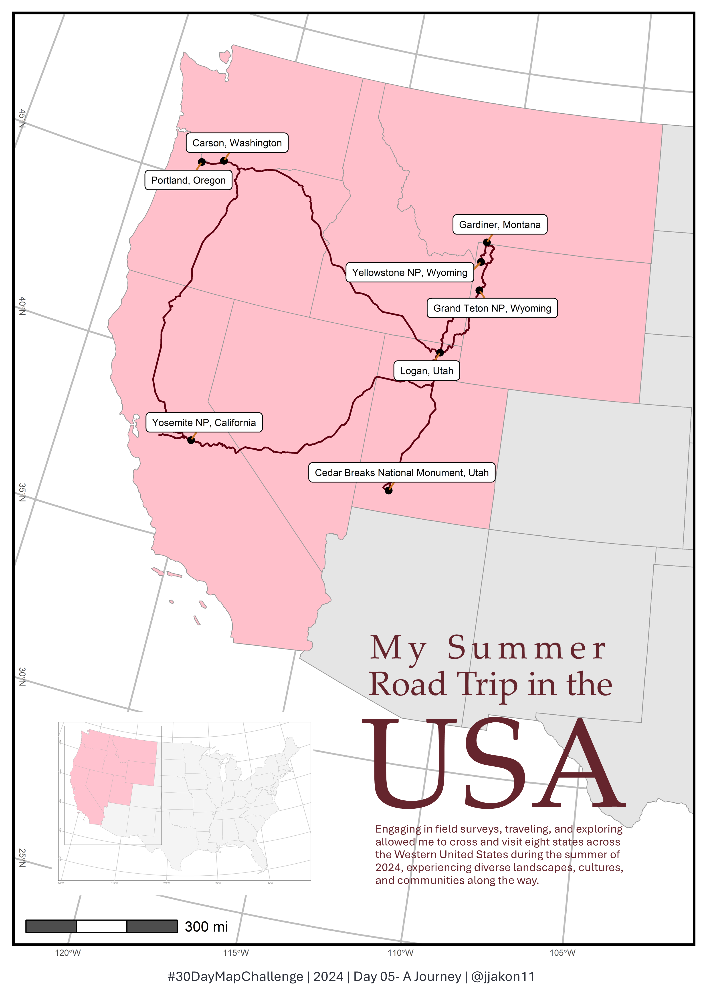

# 30 Day Map Challenge
## 2024 Challenge

The details of the challenge can be found: [here](https://30daymapchallenge.com/). The challenge was set by Topi Tjukanov since 2019.

This is my second year attending the 30-Day Map Challenge on social media, which posts a map produced every day in November. If you are interesting in my first year mapping, then welcome in -> [2023_challenge](https://github.com/jjakon11/30DayMapChallenge/tree/main/2023_Challenge)

Daily topic for this year, 2024, in November:

***

### Day1: Points
**Taiwan's Lighthouse**

Taiwan is a country made up of multiple islands located at the west of the Pacific Ocean. A lighthouse directs people on the ocean, telling them, 'Hey, this is the way home.' 

***

### Day2: Lines
**Mt. Jade, Taiwan**

Mt. Jade, or Yushan, is the highest mountain in Taiwan. The lines on the map represent longitude, not contour lines. This figure was inspired by a similar image of the Himalayas on Xwitter, and I attempted to recreate it without any reference code. This truly captures the shape of Mt. Jade, the highest peak in Taiwan.

***

### Day3: Polygons

**Yushan (Mt. Jade) National Park, Taiwan**

Yushan (Mt. Jade) National Park is the highest national park in Taiwan. I mapped the contour plot and clipped it to the park boundaries to showcase the beautiful elevation gradient of Yushan National Park, the Jade.

***

### Day4: Hexogons

**Rain**

I indirectly used a 30 m x 30 m Digital Elevation Model (DEM) and input it into Climate AP to obtain the average rainfall for each grid over 30 years, from 1991 to 2020. I then created a hexbin map to show the rainfall density. 

***

### Day5: A Journey

**My Summer Road Trip in USA**

I mapped my summer road trip across the United States this year, which included a field survey and travels with my boyfriend. The breathtaking landscapes are now unforgettable memories. I will treasure it. 

***
