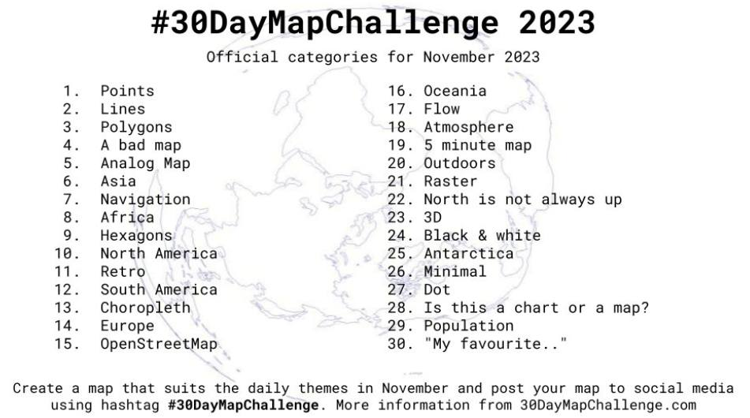
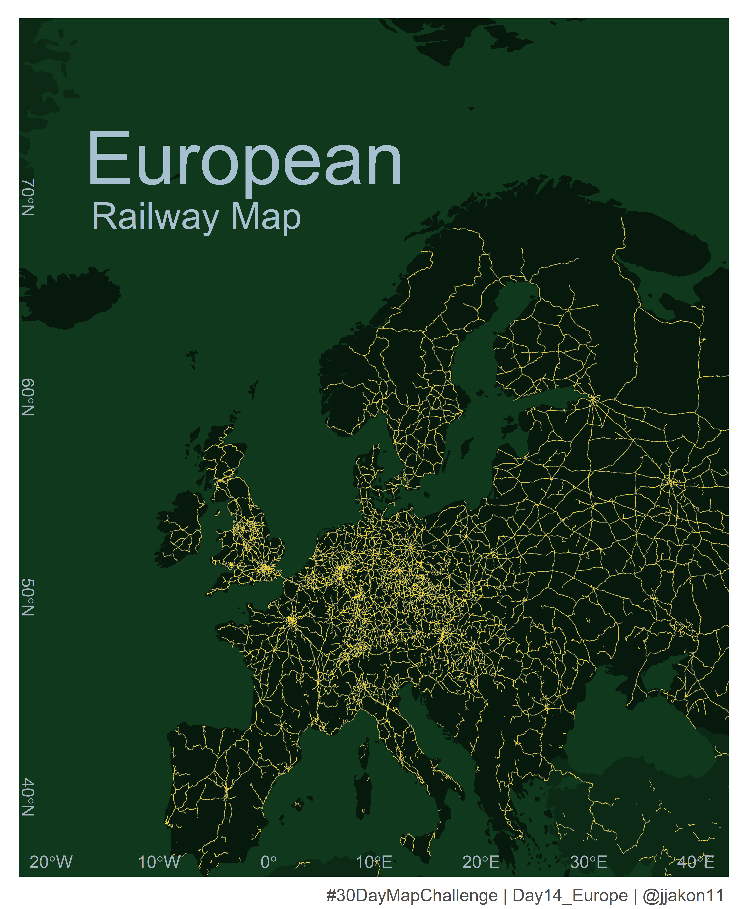
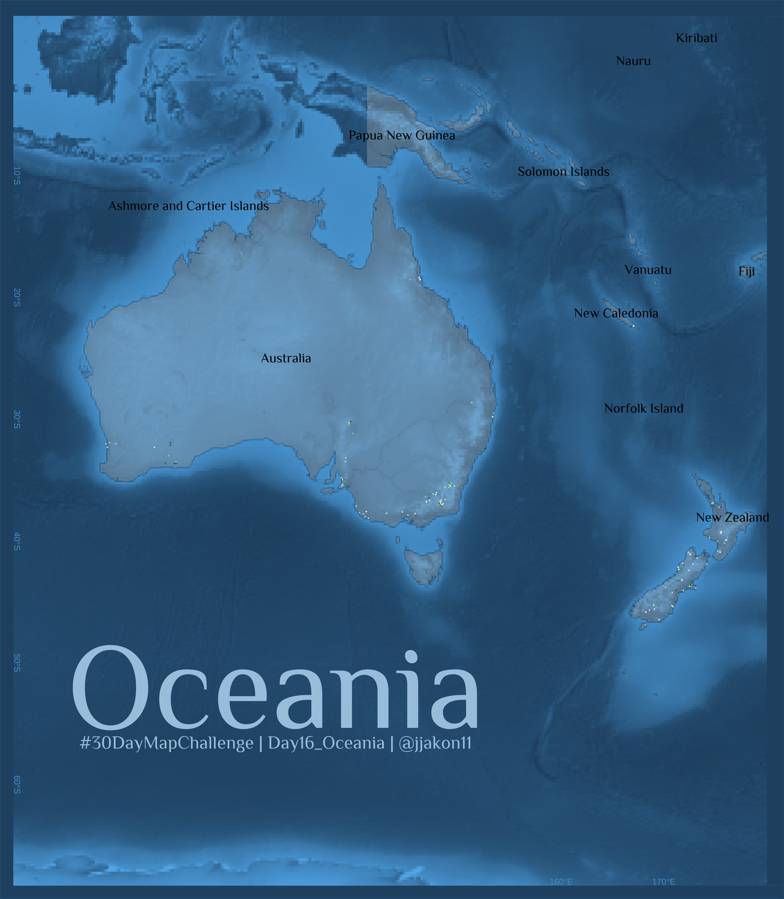
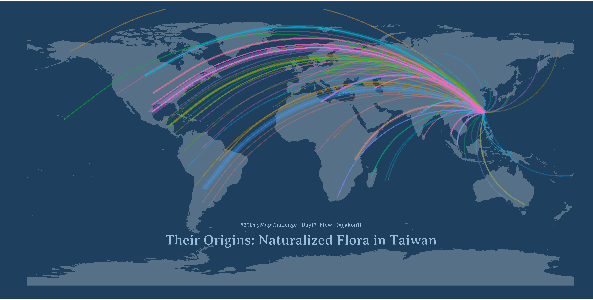
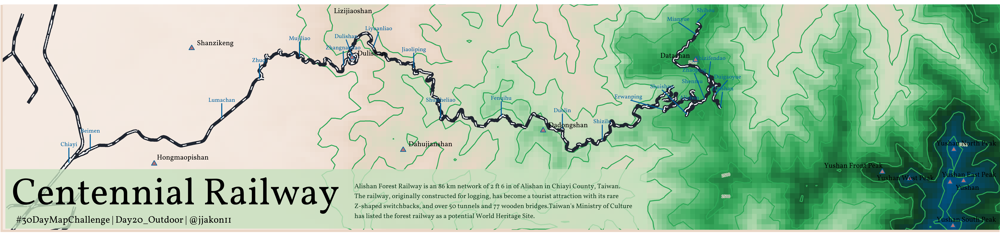
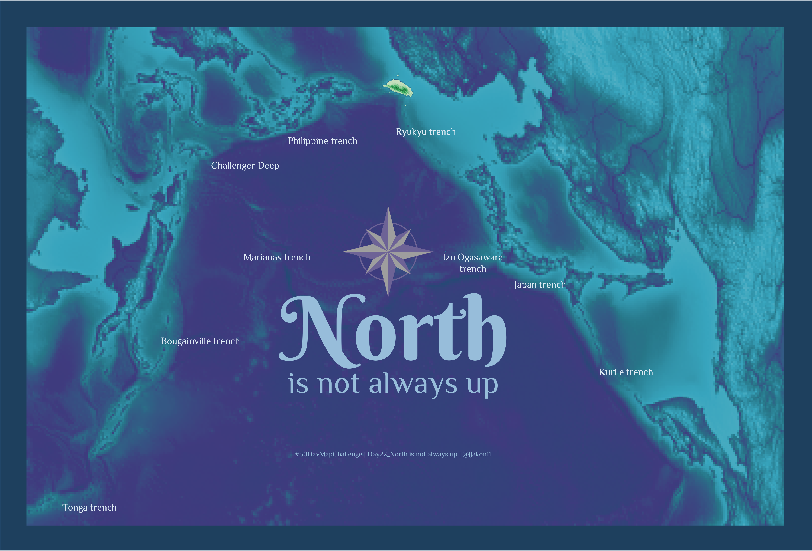
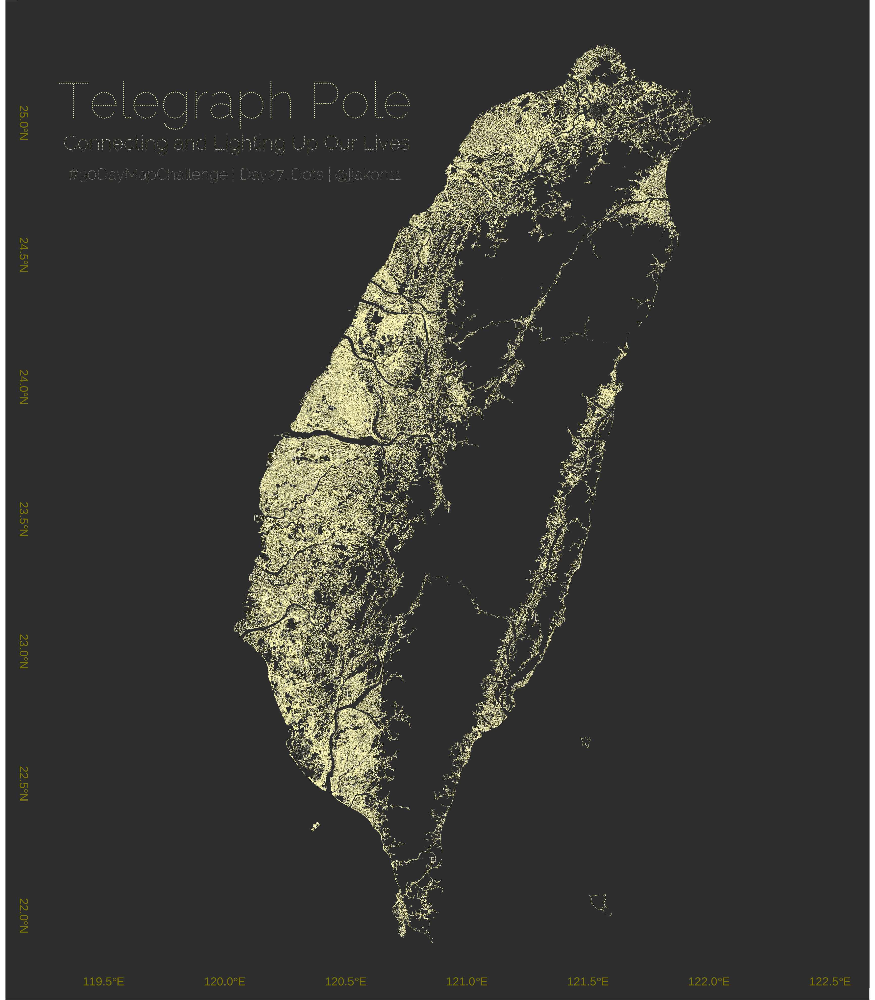
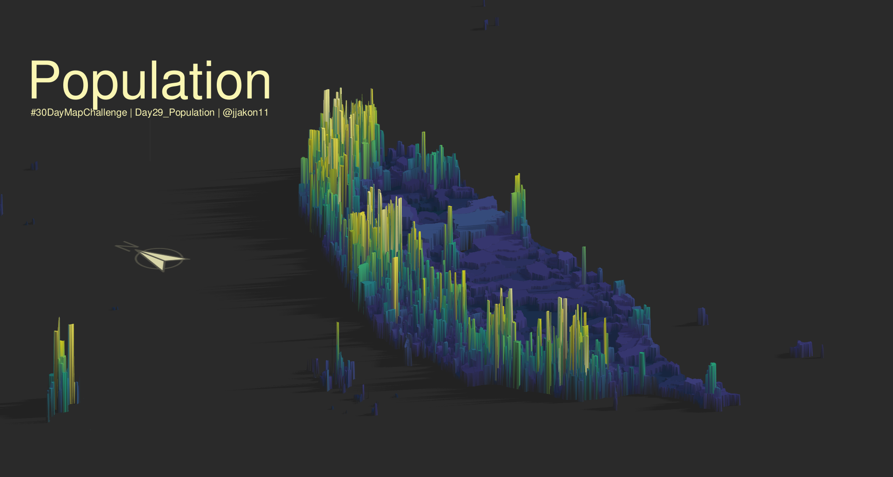
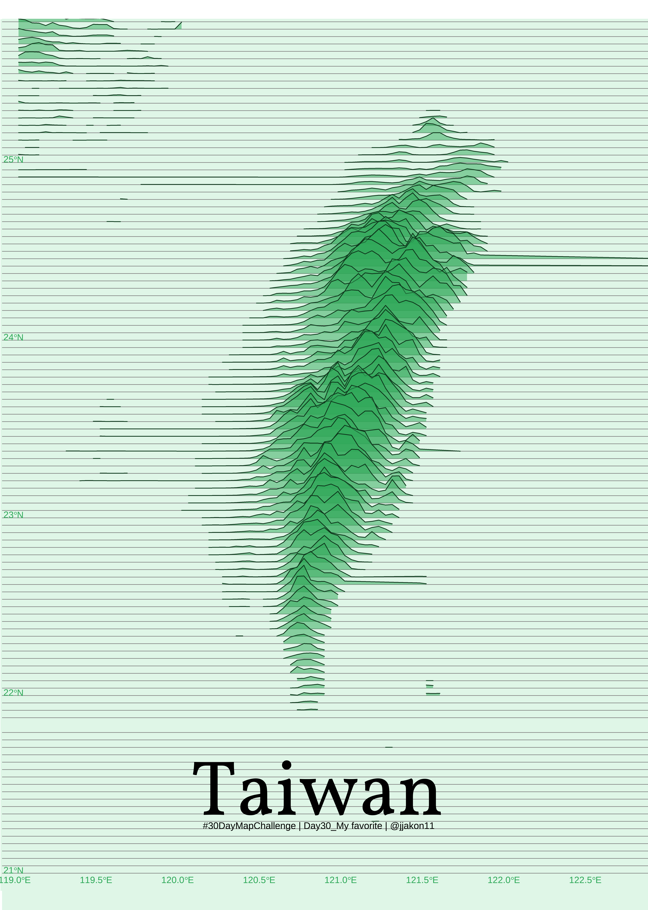

# 30 Day Map Challenge
## 2023 Challenge
The details of the challenge can be found: [here](https://30daymapchallenge.com/). The challenge was set by Topi Tjukanov since 2019.

This is my first year attending the 30-Day Map Challenge on social media, which posts a map produced every day in November.

Daily topic for 2023 in November:

***

### Day1: Points
**Map point of Taiwan climate station**
I attend a great challenge in this November. No idea when I will give up this hard core challenge. My goal is to out put all of the map by R program around 1 hours (hopefully...). 

### Day2: Lines
**River Map in Taiwan**

Second day challenge of plotting map with R program: Lines. I utilized Taiwan's main river and tributary shapefiles to represent the contours of our island.  An Ocean Digital Elevation Model (DEM) is also included as the base map to highlight the island's remarkable features.

- Data resource: 
  
  - River and Tributary: https://gic.wra.gov.tw/Gis/Gic/API/Google/Index.aspx
  
  - Ocean DEM: https://www.gebco.net/

  
### Day3: Polygons
**Village Map of Taiwan**

My third-day challenge: mapping a graph with the R program using Polygons. This is a basic graph for those starting to learn how to plot with GIS. The graph shows the number of people living in different villages in Taiwan in 2022. Each polygon in this graph represents a village. In this graph, I aim to depict the level of luxury in each big city and the tranquility in each small downtown. And where are you now?
(I think the most challenging step is not coding but choosing great colors. Last night, I spent 2 hours to output this graph...for color selection)

- Data source: 
  - Taiwan Village shape file: < https://data.gov.tw/dataset/17219 >
  - Population data: < https://data.gov.tw/dataset/117988 >
  - Ocean DEM: < https://www.gebco.net/ >

### Day4: A Bad Map
**Islands**

A Bad Map day, with no clear indication of its location or the information it conveys. In this map, I used the county shapefile to represent the outlying islands of Taiwan. Try to figure out where are those island distributed in the Earth. I won't be providing an explanation today, as it's a BAD map

- Data source:

 - Taiwan county shape file: < https://data.gov.tw/dataset/7442 >
 - Taiwan Village shape file: < https://data.gov.tw/dataset/17219 >

### Day5: Anolog Map
**Humboldt's Naturgemälde**

Day 5 of my 30-day map challenge, I aim to present the species distribution along the varying elevation gradients of volcanoes Chimborazo and Cotopaxi in Ecuador . This distribution map was originally produced by Alexander von Humboldt and is referred to as 'Naturgemälde,' published in his book 'The Geography of Plants' in 1807.

- More information: https://en.wikipedia.org/wiki/Alexander_von_Humboldt

### Day6: Asia
**Distribution of 𝘔𝘪𝘵𝘳𝘢𝘴𝘵𝘦𝘮𝘰𝘯 𝘺𝘢𝘮𝘢𝘮𝘰𝘵𝘰𝘪 var. 𝘺𝘢𝘮𝘢𝘮𝘰𝘵𝘰𝘪  and its variants**

Day 6 of my 30 day map challenge is to present the distribution of 𝘔𝘪𝘵𝘳𝘢𝘴𝘵𝘦𝘮𝘰𝘯 𝘺𝘢𝘮𝘢𝘮𝘰𝘵𝘰𝘪 var. 𝘺𝘢𝘮𝘢𝘮𝘰𝘵𝘰𝘪 and 𝘔𝘪𝘵𝘳𝘢𝘴𝘵𝘦𝘮𝘰𝘯 𝘺𝘢𝘮𝘢𝘮𝘰𝘵𝘰𝘪 var. 𝘬𝘢𝘯𝘦𝘩𝘪𝘳𝘢𝘪 in Asia. 

- Data source: 
  - Species data: < https://www.gbif.org/occurrence/search >

### Day7: Navigation
**Ready to explore Africa**

*Flight Information*
Flight EK367: 23:40---9 hr 55m---05:35
Flight EK770: 03:50---9 hr 50m---11:40

On Day 7 of my 30-day map challenge, I present the route from Taoyuan to Cape Town International Airport for Emirates airline flights EK367 and EK770.

- Data source: 
  - Flight data: < https://zh-tw.flightaware.com/live/airport/OMDB >

### Day8: Africa
**Leopard in Africa**

On Day 8 of my 30-day map challenge, I present Leopard distribution in Africa from the GBIF database. It's been a busy week, making it a bit of a challenge to frame out the idea and also collect the data from the open database.

- Data source: 
  - Leopard data: < https://doi.org/10.15468/dl.7tbasq >

### Day9: Hexagons
**TaiStamp**

Day 9 of my 30-day map challenge, presenting a fake stamp of Taiwan's topographic figure with hexagons. I used the DEM of the island and the ocean to illustrate the density of the elevation around Taiwan.

- Data source:
  - TaiwanDEM: < https://data.gov.tw/dataset/35430 >
  - Ocean: < https://www.gebco.net/ >

### Day10: NorthAmerica
**Railway in North America**

Day 10 of my 30-day map challenge, presenting the railway of North America.

- Data sources:
  - Ocean O2 distribution: < https://www.nodc.noaa.gov/OC5/WOA05/pr_woa05.html >
  - Railway : < https://hub.arcgis.com/....../fedmaps::north....../about >

### Day13: Choropleth
**Records of Specimens in the Wild**

On the 13th day of my 30-day map challenge, I plot the distribution of plant specimens recorded in the wild. I utilized the herbarium collection data from GBIF in Taiwan.  I use the point transparency to present the varying levels of collecting frequency during different periods.

- Data source:
  - Ocean: < https://www.gebco.net/ >
  - Gbif data: < https://doi.org/10.15468/dl.fm2gfh >

### Day14: Europe
**European Railway Map**

On the 14th day of my 30-day map challenge, I use the R program to present the railway map of Europe, which boasts the highest railway density in the world.

- Data source:
  - railway: < http://www.mapcruzin.com/dow....../europe-railways-shape.zip >

### Day15: Open Street Map
**Chiayi, Taiwan**

On the 15th day of my 30-day map challenge, I mapped my hometown, Chiayi, Taiwan, which was a wood production city in the past.

### Day16: Oceania
**Oceania**

On the 16th day of my 30-day map challenge, I used the Ocean Bottom map along with the distribution of 308 plant species to illustrate the map of Oceania

- Data source: 
  - Ocean bottom map : < https://www.naturalearthdata.com/ >
  - gbif: < https://doi.org/10.15468/dl.n5849k >
  

### Day17:Flow
**Their Origin: Naturalized Flora in Taiwan**

My 17th map in the 30-day map challenge aims to present the original areas of naturalized species in Taiwan. I compiled the naturalized data from Chang-Yang et al. (2022), published in Taiwania, to understand the origins of these species through a visualization map.

- Data source:
  - Naturalized species: < https://doi.org/10.6165/tai.2022.67.1 >

### Day18: Atomosphere
**Change of the Global Temperature**

On the 18th day of the 30-day map challenge, I mapped global temperature changes from 1990 to 2022. Each data point in every grid represents the temperature difference between the value in a specific year and the mean value of 1990-2020.

- Data source: 
  - Temperature data < https://www.ncei.noaa.gov/....../ghcn....../data-access >
  - Temperature data Reference: < https://doi.org/10.1175/JCLI-D-18-0094.1 >

### Day19: 5 Minute Map
**Copy the code to enhance work efficiency**

On the 19th day of the 30-day map challenge, I spent five minutes plotting the streets around Taipei Station. I copied my previous code, JUST changed the location and color, and still couldn't finish it to be perfect. So, it is conceivable that starting from 0 would take more time than this.

### Day20: outdoor
**Alishan Centennial Railway**

On the 20th day of the 30-day map challenge, I mapped the Alishan Railway in Taiwan, which has been constructed for the wood production business for a hundred years. If you need to hike to the mountain, taking the train to reach the Alishan Forest Trail is the best idea.

- Data source: 
  - TaiwanDEM: < https://data.gov.tw/dataset/35430 >
  - Raiway: OpenStreetMap台灣
  - Information about the railway: < https://en.wikipedia.org/wiki/Alishan_Forest_Railway >

### Day21: Raster
**Hot citizen science**

On the 21st day of the 30-day map challenge, I mapped the heatmap of vascular records based on human observations from 2010 to 2023. This allows us to understand the relationship between species distribution hotspots and human activity in Taiwan.

- Data source: 
  - species distribution: < https://doi.org/10.15468/dl.3fs3cv >

### Day22: North is not always up
**North is not always up**

On the 22nd day of the 30-day map challenge, I mapped the rotated Pacific Ocean, starting from the Taiwan island.

- Data source: 
  - Ocean DEM : < https://www.naturalearthdata.com/ >
  

### Day23: 3D
**Taiwan, An Islands After Plate Collision**

On the 23rd day of the 30-day map challenge, I mapped a 3D topographic Taiwan map with the Taiwan DEM and Ocean DEM data.

- Data source: 
  - Ocean DEM : < https://www.naturalearthdata.com/ >
  - Taiwan DEM: <  https://data.gov.tw/dataset/35430 >  

### Day24: Black and white
**YiLan City**

On the 24th day of the 30-day map challenge, I mapped a black and white map using OpenStreetMap for Yilan City, Taiwan.

### Day25: Antarctia
**Antarctia**

On the 25th day of the 30-day map challenge, I mapped an Antarctica map.

### Day26: Minimal
**Nauru: the minimal island country in the world**

On the 26th day of the 30-day map challenge, I mapped street lines for the smallest island country in the world, Nauru.

### Day27: Dots
**Telegraph pole, Connecting and Lighting Up Our Lives**

On the 27th day of the 30-day map challenge, I mapped the distribution of telegraph poles in Taiwan, which are essential facilities for connecting and lighting up our daily lives.
Those are dots, not lines!!!

- Data source: 
  - Telegraph pole data: https://data.gov.tw/dataset/33305
  

### Day28: Is this chart or a map
**Top 10 cities with the densest telegraph poles**

On the 28th day of the 30-day map challenge, I compiled the data on telegraph pole density and outputted a chart of pole density polygons for each county in Taiwan. 

- Data source: 
  - Telegraph pole data: https://data.gov.tw/dataset/33305

### Day29: Population
**3D Population distribution in Taiwan** 

On the 29th day of the 30-day map challenge, I plotted the population distribution using a 3D map to illustrate the distribution of people in Taiwan. 

- Data source: 
  - Population data:  https://data.gov.tw/dataset/117988 

### Day30: My Favorite
**Taiwan**

Finally, on the 30th and last day of my map challenge, I created a Joy plot to illustrate the ridge pattern of the entire Taiwan. Simple yet beautiful.

- Data source: 
  - TaiwanDEM: < https://data.gov.tw/dataset/35430 >

